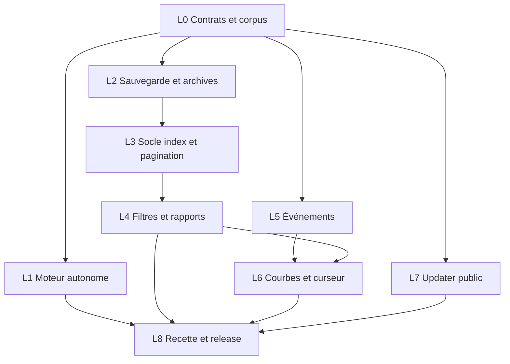

> **Recette de livraison 0.6.0 :** voir [RELEASE-0.6.0.md](RELEASE-0.6.0.md).
> Ce document conserve le plan et les étapes de validation historiques ; les mentions
> « aucune release » ci-dessous décrivent leur état au moment du contrôle.

> **Exécution en cours :** suivre [IMPLEMENTATION-0.6.0.md](IMPLEMENTATION-0.6.0.md), les [contrats](CONTRACTS-0.6.md) et les états du [backlog](BACKLOG-0.6.0.md). Les descriptions et gates ci-dessous sont le plan de référence, pas une annonce de release.

# KataLog 0.6.0 — plan de développement

**Statut : proposition actualisée le 30 septembre 2026, après audit du code.**
Référence locale : **0.5.2 (7)**, parseur **1.2.0**, macOS 27.
Le plan initial partait de 0.5.1 (6) ; le socle de distribution a été livré depuis.
Ce document prépare la prochaine version ; ses fonctionnalités et ses objectifs
de performance ne sont pas encore livrés ni validés.

Lire aussi l'[audit vérifié](AUDIT-2026-09-30.md) et le
[backlog exécutable](BACKLOG-0.6.0.md), avec tâches, dépendances et critères de fin.
Les résultats actuels sont **87 tests Python + 79 Swift + 9 JavaScript réussis**.
L'utilisateur a installé l'app et confirme son fonctionnement sur macOS 27.

## Stabilisation préalable : 0.5.3 proposée

L'audit a relevé des incohérences de présentation et d'identité que les suites
actuelles ne couvrent pas. Les corriger avant les migrations et nouvelles analyses :

- C01 : même identité canonique entre résumé, fiche, numéro manuel et export.
- C03/C12 : phases de collecte explicites ; aucun verdict complet si un inventaire échoue.
- C04/C05/C06/C07 : comptes HTML filtrés, famille devenue vide, registre/périmètre,
  définition commune des familles et failsafes.
- C09/C11 : récepteur GNSS et couverture de la durée de vol visibles.
- C02/C08 : disponibilité minimale des sources et export occupé dès le correctif ;
  services complets de stockage/progression/annulation en L2/L4.
- C10 : dernière analyse en cache conservée dans le correctif, même sans source
  réanalysable. Ce prérequis bloque toute évolution ultérieure du parseur/cache.

La version 0.5.3 est un lot proposé, pas une release créée. Ajouter une régression
pour chaque cas, puis vérifier le package installé. La correction d'un filtre
existant n'autorise pas l'intégration d'une nouvelle interface sans maquette approuvée.

## Avancement du socle de distribution

La version locale 0.5.2 (7) livre le moteur autonome et le DMG sans livrer les
autres lots 0.6.0. Helper ARM64 : CPython 3.13.15, NumPy 2.5.3, pyulog 1.2.4,
versions/hashes/licences embarqués ; résolveur commun import/collecte avec handshake.
Les tests du code et du package restent distincts de la recette sur Mac vierge.
Mac du poste : macOS 27 ; minima Mach-O vérifiés pour macOS 15. Une recette
exécutée sur macOS 15 reste requise avant de déclarer cette version qualifiée.

## 1. Objectif de la version

Faire de KataLog une bibliothèque durable pour l'historique d'une flotte de
**500 drones**, avec une analyse plus approfondie des logs et une installation
autonome sur Mac Apple Silicon.

Le parcours cible : collecter ou importer → conserver une copie vérifiée si
nécessaire → retrouver un drone et une période → comprendre les observations
dans leurs courbes et sur la carte → exporter exactement le périmètre choisi.

### Parcours utilisateur

| Fonction | Résultat attendu en 0.6.0 |
|---|---|
| Installation | Télécharger le DMG, glisser KataLog dans Applications ; sans Python/Homebrew ni App Store |
| Grand historique | Rechercher et naviguer sans charger tous les messages en mémoire |
| Filtres | Période, plusieurs drones, famille, niveau, recherche ; vues enregistrées |
| Fiche d'analyse | Courbes Batterie, GNSS et EKF disponibles selon les topics du log |
| Chronologie | Curseur commun entre courbes, messages, événements et carte |
| Événements PX4 | Événements binaires conservés ; traduction lorsque le dictionnaire exact est disponible |
| Conservation | Archivage SD optionnel, état des sources et sauvegarde/restauration complète |
| Rapports | Choix explicite entre sélection courante et bibliothèque complète |
| Mises à jour | Vérification et installation Sparkle depuis les releases publiques signées |

**Socle de livraison :** lots L0 à L7 et recette L8. La distribution publique
requiert un audit des fichiers, de l'historique et des assets, puis une publication
sans données personnelles. Le décodage de tout firmware constructeur n'est pas
une condition de livraison : les événements non traduits restent exploitables.

## 2. Point de départ vérifié

- Import SHA256, SQLite, collecte GCS, numéros manuels, familles personnalisées,
  carte Apple Maps et rapport HTML interactif existent déjà.
- La distribution locale 0.5.2 est signée Developer ID et notarisée ; Python,
  `pyulog` et `numpy` sont embarqués. La 0.5.1 historique utilisait un moteur
  externe. Aucun updater n'est intégré dans ces deux versions.
- Les résumés, messages et aperçus GPS sont encore chargés globalement.
  SQLite stocke principalement des résumés JSON ; les détails sont déjà chargés
  à la demande et mis en cache.
- Les imports SD référencent les originaux. Les logs GCS disposent déjà d'une
  copie locale vérifiée dans le dossier choisi, conservé au redémarrage.
- Les filtres natifs sont temporaires et l'export flotte reçoit toute la
  bibliothèque. Le rapport HTML possède ensuite ses propres filtres locaux.
- Le [benchmark existant](BENCHMARK-500.md) a analysé **500 identités et SHA
  distincts**, sur 500 variantes d'un petit ULog : environ 458 Mo de sources,
  10 000 messages. Il ne mesure pas plusieurs années de logs ni la mémoire SwiftUI.
- Les événements binaires du corpus de recette sont encore seulement comptés.
  Les topics disponibles varient ; leur présence n'est pas supposée pour chaque drone.
- L'audit du 30 septembre exécute **87 tests Python, 79 Swift et 9 JavaScript**
  avec succès. La publication historique 0.5.1 consignait 68/64/9 tests.
  Aucun de ces résultats ne constitue une validation des fonctionnalités 0.6.
- Le dépôt neuf reste privé ; les changements de distribution 0.5.2 sont encore
  dans le working tree. Figer leur commit avant la prochaine livraison.

Sources locales : [contrat](IMPORT-CONTRACT.md), [recettes](UI-VALIDATION.md),
[collecteur](GCS-COLLECTION.md), [release](RELEASING.md).

## 3. Règles à préserver

1. SHA256 et identités source restent stables. Un numéro de stock commun ne
   fusionne jamais automatiquement deux contrôleurs.
2. Numéros manuels, familles d'origine et reclassements sont conservés lors
   des réanalyses, migrations, sauvegardes et mises à jour.
3. Toutes les alertes et tous les messages restent enregistrés. Un filtre ou un
   masquage modifie la présentation ; **Afficher les messages masqués** et
   **Réinitialiser** permettent de tout retrouver.
4. Un WARN, ERROR ou événement décrit une observation. L'app distingue le
   message source, son explication documentée et une éventuelle hypothèse de panne.
5. Une valeur inconnue reste inconnue. L'absence de topic, de GPS ou de durée de
   vol calculable ne devient pas un zéro ni une preuve d'absence de problème.
6. Les imports ne modifient pas les originaux. Une copie GCS finale vérifiée est
   réutilisée ; l'archivage ne crée pas un second téléchargement ou une seconde
   copie locale obligatoire.
7. Le collecteur reste limité au listing et à la récupération des logs de la
   flotte autorisée. Deux UUID en parallèle, un fichier par UUID, restent la
   limite tant qu'une recette réelle ne justifie pas un changement.
8. Les données restent locales ; GitHub reçoit le code et les assets de release,
   pas les ULog, bibliothèques, rapports privés ou identifiants d'authentification.

## 4. Parcours et interface

Conserver le bento monochrome clair/sombre, la navigation et les accents actuels.
Les nouveaux écrans feront l'objet de maquettes avant leur intégration, conformément
à la validation visuelle prévue avant intégration.

- **Vue d'ensemble** : barre de périmètre commune, compteurs, activité et profil
  des alertes. Les graphiques sélectionnent une période ou une famille et
  affichent le nombre de logs concernés, avec accès aux valeurs détaillées.
  L'ensemble et l'ordre des axes radar choisis restent identiques sous filtre,
  avec valeurs zéro conservées ; un changement d'axes est annoncé. Le top des
  familles fréquentes est un classement distinct du radar.
- **Historique / Drones** : résultats paginés, sélection multiple, numéro manuel,
  dernier log, état des sources et couverture. Les drones sans log restent dans
  le registre de flotte ; ils ne reçoivent pas une statistique de fiabilité fictive.
- **Alertes** : familles dynamiques et groupes recherchables ; explication,
  occurrence source, classement et masquage réversible accessibles au même endroit.
- **Fiche** : carte et chronologie, onglet d'analyse avec recettes Batterie/GNSS/EKF,
  événements, puis données et provenance. Quatre courbes visibles au maximum au
  départ ; unités, récepteur et lacunes restent lisibles.
- **Rapports** : choix du périmètre, compteurs avant export, rappel des filtres,
  option d'inclure les messages masqués et état de progression annulable.
- **Réglages → Stockage** : dossier de collecte, archivage SD, espace nécessaire,
  sources manquantes, sauvegarde et restauration avec prévisualisation.
- **KataLog → Rechercher des mises à jour…** : version disponible, notes et progression ; proposition de relancement quand les opérations locales
  sont terminées ou arrêtées explicitement.

### Contrat du périmètre

Créer un `SelectionScope` partagé : identités de contrôleur, période, traitement
des dates inconnues, familles, niveaux/alertes, recherche, état d'analyse et
masquages. Les numéros sont des libellés ; les identités canoniques restent les
clés (UUID lorsqu'il est disponible, fallback source sinon).

Les filtres de messages retiennent les logs qui possèdent une occurrence
correspondante. Un failsafe sans message contribue au compteur seulement lorsqu'un
filtre de famille/niveau/texte ne lui impose pas une correspondance inventée.
Les dates de chemin restent dans leur calendrier source ; les dates UTC sont
identifiées comme telles. Les dates inconnues ont une option explicite.

Chaque écran rappelle son périmètre. Ouvrir une fiche permet de consulter tout
le log avec une action clairement indiquée. La carte conserve sa limite de
**80 trajectoires récentes** ; les compteurs et les exports portent sur tous
les résultats sélectionnés, indépendamment des pages visibles.

## 5. Lots de développement

| Lot | Livraison | Dépendances | Charge relative |
|---|---|---|---|
| L0 | Contrats, corpus et banc de référence | — | M |
| L1 | Moteur autonome dans l'app | L0 | L |
| L2 | Sauvegarde, restauration et archives | L0 | L |
| L3 | Requêtes SQLite et pagination | L0, sauvegarde L2 | L |
| L4 | Périmètre commun, vues et exports | L3 | L |
| L5 | Événements binaires et explications | L0 ; intégration avec L3 | M/L |
| L6 | Courbes et curseur commun | L0, L5 ; intégration L3/L4 | L |
| L7 | Mises à jour publiques | prototype dès L0 ; L1/L2 avant installation | M |
| L8 | Recette complète et publication | L1–L7 et audit de confidentialité | L |

Les tailles indiquent la complexité, pas une durée calendaire. L1, L2 et
l'extraction L5 peuvent avancer séparément après L0 ; L3/L4 forment le chemin
principal. Les fichiers partagés `Models.swift`, `LibraryStore` et les contrats
sont intégrés dans un ordre explicite pour éviter des modifications concurrentes.
Les lots se chevauchent : le socle SQL L3 précède les vues L4, mais la carte et
le banc UI final L3 utilisent ensuite le scope Core L4. La matrice des rapports
est spécifiée avant L5/L6 ; les sections événements/courbes sont qualifiées lors
de leur intégration. Les portes du backlog portent sur ces fonctionnalités,
pas sur la fermeture artificiellement séquentielle de tous les tickets d'un lot.

### L0 — Référence reproductible et contrats

- [ ] Séparer version de base SQLite, version du JSON public et version de calcul.
  `SCHEMA_VERSION` sert actuellement à la base et au JSON : ne pas les faire
  évoluer implicitement ensemble.
- [ ] Versionner aussi le protocole de service. Toute réponse paginée porte
  request ID, révision, empreinte du périmètre et curseur opaque ; une réponse
  tardive pour un ancien filtre n'est pas appliquée à l'écran courant.
- [ ] Définir les contrats `SelectionScope`, agrégats/pages, manifeste de sauvegarde,
  événements bruts, catalogue de séries et réponse d'extraction.
- [ ] Conserver les commandes `scan`, `snapshot`, `detail` et l'export complet
  `schemaVersion: 1`. Les nouvelles API ont leur propre contrat versionné.
- [ ] Créer des fixtures synthétiques partageables : erreurs, dates inconnues,
  plusieurs UUID/récepteurs, annotations, événements inconnus et séries trouées.
- [ ] Séparer les tests autonomes des recettes avec ULog privés. Préparer une CI
  Python/Swift/JavaScript sans publier ces ULog ni les secrets de signature.
- [ ] Mesurer la version de référence et fixer les objectifs du §7 avant optimisation.

**Sortie :** contrats documentés et corpus déterministe ; correspondance exacte
avec les compteurs actuels sur le corpus privé. Une CI verte sur fixtures ne
remplace pas la recette privée ni les essais GCS.

### L1 — Installation autonome

- [x] Helper ARM64 embarquant Python, `pyulog`, `numpy` et les scripts,
  versions épinglées, empreintes et licences. Retenu : PyInstaller `onedir`
  structuré en bundle macOS imbriqué, composants signés avec Developer ID.
- [x] Résolveur `EngineRuntimeResolver` commun à `AnalysisService` et
  `GCSProcessService`, avec environnement des processus nettoyé.
- [x] Utiliser le helper embarqué en release ; conserver un override de moteur
  explicite pour le développement, avec handshake de version du protocole.
- [x] Signer les composants natifs imbriqués puis l'app ; produire un DMG
  contenant **KataLog.app** et un lien **Applications**, avec présentation claire
  pour glisser-déposer. Aucun script Terminal n'est requis pour l'utilisateur.
- [x] Notariser le DMG et agrafer les tickets appropriés ; réauditer les fichiers
  montés et tester l'app copiée depuis le DMG. Mesurer taille et démarrage du moteur.
  Recette locale : macOS 27, DMG 15,86 Mo, 8 contrôles de distribution réussis.
  Voir [la validation 0.5.2](DISTRIBUTION-VALIDATION.md) et ses limites.
- [ ] Tester téléchargement → montage → glisser dans Applications → éjection →
  lancement, puis remplacement d'une ancienne app après fermeture. Bibliothèque,
  numéros et dossier de collecte restent conservés hors du bundle.
  Le parcours local et l'installation utilisateur sont déjà réussis sur macOS 27 ;
  restent la provenance téléchargée/quarantinée, le Mac vierge/macOS 15 et la
  recette de remplacement de la prochaine build.

**Sortie :** app réellement téléchargée et quarantinée, sur macOS 15 et sur
la version du poste de recette Apple Silicon, sans Python, Homebrew, `gh`, Xcode
ou Command Line Tools requis. Import, réimport, fiche, export et simulateur GCS
fonctionnent hors ligne avec le moteur du bundle. L'app déplacée dans
`~/Applications` ou `/Applications` ne dépend d'aucun chemin du poste de développement.

**Responsabilité :** services Core, ressources Python, `tools/build-app.sh`,
pipeline de packaging et tests du moteur.

### L2 — Conservation et récupération de la bibliothèque

- [ ] Créer une sauvegarde cohérente : API de backup SQLite, annotations, vues,
  flotte, réglages et manifeste des sources. Proposer **Analyses et réglages**
  ou **Sauvegarde complète avec ULog** ; afficher les sources absentes et la taille.
- [ ] Arrêter les écritures locales pendant la capture commune des fichiers de
  configuration ; ne pas copier seulement SQLite en ignorant son journal WAL.
- [ ] Coordonner aussi les instances de l'app : verrou interprocess avec propriétaire
  identifiable, seconde instance en lecture seule ou refus lisible. Tester ancien
  et nouveau bundle ouverts ensemble, sans supprimer une app automatiquement.
- [ ] Restaurer dans un staging, vérifier formats et empreintes, prévisualiser
  les résultats puis basculer ; conserver la bibliothèque précédente.
- [ ] Réassocier les archives au dossier choisi sur le Mac cible, avec SHA
  vérifié et anciens chemins conservés comme provenance. Préserver le réglage
  du dossier de collecte ; s'il est inaccessible, le signaler sans fallback.
- [ ] Ne jamais restaurer des jobs en transfert comme actifs : ils deviennent
  interrompus et attendent un inventaire de la GCS avant reprise.
- [ ] Proposer pour la SD **Référencer les originaux** ou **Copier dans mes archives**.
  Copie temporaire → taille/SHA vérifiés → publication → import. Préserver la
  provenance et réutiliser la copie finale GCS vérifiée lorsqu'elle existe.
- [ ] Afficher l'état des sources ; permettre de retrouver un fichier déplacé
  par son SHA. Un chemin d'origine est une provenance, pas une preuve actuelle.
- [ ] Distinguer source présente vérifiée, absente, inaccessible, volume hors ligne
  et contenu modifié, avec date de contrôle. Conserver la dernière analyse en cache
  et sa version si une réanalyse est impossible ; ne pas la supprimer à l'upgrade.
- [ ] Borner les archives à restaurer : chemins relatifs contrôlés, liens refusés,
  taille décompressée/empreintes validées. La prévisualisation distingue sources
  incluses, référencées, manquantes et jobs interrompus.

**Sortie :** restauration sur une bibliothèque vide et dans un autre emplacement
avec mêmes IDs, messages, numéros, familles et SHA. Annulation, disque plein ou sauvegarde corrompue ne
remplacent pas la bibliothèque active. Un log SD archivé reste réanalysable
après retrait de la carte. Les secrets du Trousseau ne sont pas exportés.

**Responsabilité :** service de sauvegarde/archives, `analyzer.py`, stores
d'annotations/GCS et écran Stockage.

### L3 — Bibliothèque adaptée au grand historique

- [ ] Migration transactionnelle depuis les bases 0.5.1/0.5.2/0.5.3, après sauvegarde vérifiée ;
  reprise explicite et refus lisible d'un format futur inconnu.
- [ ] Ajouter des projections indexées logs/messages/date/identité/famille/niveau,
  et un index de recherche adapté aux requêtes réellement utilisées. Les textes
  et métadonnées source restent conservés ; les projections sont reconstruisibles.
- [ ] Ajouter des commandes locales d'agrégats, pages de logs, groupes et
  occurrences. Pagination stable avec identifiant de départage et révision de
  bibliothèque ; annulation et rejet d'une réponse devenue obsolète.
- [ ] Remplacer le snapshot intégral de `LibraryStore` par agrégats et pages
  bornées. Charger les détails/aperçus nécessaires à la carte à la demande.
- [ ] Intégrer les annotations dans les résultats et les agrégats, avec
  invalidation/version de projection à chaque édition.
- [ ] Conserver un seul chemin d'écriture vers la base ; gérer les lectures
  pendant import sans maintenir une transaction de lecture indéfinie.
- [ ] Inclure file/historique de collecte dans le travail de capacité : jobs
  indexés et paginés, inventaires progressifs, pages bornées. Le protocole GCS
  et ses essais sont détaillés au §12 ; conserver la limite 2 UUID × 1 fichier.

**Sortie :** migration sans perte ; aucune omission ou répétition entre pages,
y compris dates identiques/inconnues. Recherche, familles manuelles et radar
donnent les mêmes résultats que la référence. Mémoire et latences respectent
les budgets retenus en L0.

**Responsabilité :** `analyzer.py`, nouveaux modèles/API de bibliothèque,
`AnalysisService`, `LibraryStore`, vues d'historique et carte.

### L4 — Filtres persistants et rapports du bon périmètre

- [ ] Brancher toutes les vues sur `SelectionScope` ; sélection de plusieurs
  drones, période, filtres combinables et réinitialisation unique.
- [ ] Enregistrer des vues nommées, par exemple **Batterie cette saison** ou
  **Drones à examiner**, avec masquages réversibles et restauration au lancement.
- [ ] Exporter **Sélection courante** ou **Toute la bibliothèque**, avec manifeste
  du périmètre et instant/révision de lecture. Pour une sélection, préciser si
  les messages masqués sont inclus ; les compteurs suivent ce choix.
- [ ] Garder l'export JSON complet compatible ; ajouter séparément un export
  de sélection identifié comme tel. Une sélection de messages ne prétend jamais
  constituer toutes les données du fichier ULog.
- [ ] Donner aux familles textuelles et aux états failsafe des définitions communes
  dans app/HTML/JSON. Comptages par occurrence et par log unique sont distincts ;
  toutes les cellules HTML sont recalculées après un filtre, pas seulement le total.
- [ ] Produire les données de rapport par lecture séquentielle, indépendante
  de la pagination visible. Fichier temporaire et publication finale atomique.
- [ ] Capturer une base temporaire cohérente via backup SQLite et les versions
  d'annotations/périmètre sous coordination des écritures, puis exporter depuis
  cette copie. Prévoir l'espace temporaire et la progression ; ne pas conserver
  une longue transaction de lecture sur la base active.
- [ ] Conserver le HTML autonome, ses filtres, les thèmes et l'impression.
  Pour un rapport très volumineux, proposer une synthèse avec données complètes
  jointes plutôt qu'un document interactif tronqué ou un navigateur bloqué.
- [ ] Prévisualiser synthèse flotte / sélection / fiche détaillée, sections et
  taille ; annoncer les paramètres/topics/événements/séries inclus ou indisponibles.
  Ajouter un preset optionnel de partage avec aperçu des champs masqués, sans
  promettre que tout texte libre est automatiquement dépersonnalisé.

**Sortie :** mêmes comptes pour le même périmètre dans app/HTML/JSON de sélection.
Contrôleurs homonymes, INFO classé alerte, failsafe sans message, absence de date,
famille personnalisée et zéro résultat sont couverts. Exporter pendant un import
ou une édition d'annotations produit une version cohérente datée, sans omettre des pages.

**Responsabilité :** modèle de sélection, store de vues, écrans SwiftUI,
`ReportRenderer`, `ReportInteraction` et CLI d'export.

### L5 — Événements PX4 et explications traçables

- [ ] Conserver chaque événement : identifiant source, arguments bruts,
  timestamp, séquence, instance et niveaux interne/externe, y compris les
  événements inconnus ou non destinés à un message utilisateur.
- [ ] Enrichir `PX4Event`, qui ne possède actuellement qu'un niveau. Donner
  une clé stable à chaque occurrence et distinguer ordre source/temps affiché.
- [ ] Résoudre le dictionnaire depuis des métadonnées embarquées ou un fichier
  explicitement associé à l'identité exacte du firmware ; enregistrer sa provenance
  et son empreinte. Aucun repli silencieux sur le dictionnaire PX4 `master`.
- [ ] Vérifier l'empreinte embarquée lorsqu'elle existe, la structure et la taille
  décompressée ; une association locale exige une preuve de correspondance.
  Une branche générique comme `lightshow-v1.14` ne suffit pas.
- [ ] États visibles : **Traduit**, **Dictionnaire manquant**, **Dictionnaire
  incompatible/rejeté**, **ID inconnu**, **Arguments invalides**. Conserver les
  valeurs brutes dans tous les cas.
- [ ] Ajouter les événements traduits à la chronologie ; définir une provenance
  distincte des messages texte et une règle de comptage sans fusion heuristique
  des occurrences qui ont seulement un texte ressemblant.
- [ ] Filtrer par niveau interne enregistré par défaut pour l'analyse du log,
  avec accès au niveau externe et aux valeurs inconnues. Distinguer compteurs
  messages/événements ; le profil compte les logs uniques, sans addition de
  notifications ressemblantes. Appliquer ces règles à la sélection et aux exports.
- [ ] Étendre les explications aux observations réellement rencontrées et
  documentables, avec source/version, vérifications suggérées et limites.
- [ ] Distinguer Documentée / Interprétation / Inconnue, applicabilité firmware,
  type de message, tags et valeur brute. Un titre ressemblant ne prouve pas un
  incident ; l'explication reste séparée des faits enregistrés.
- [ ] Dans **Données et provenance**, exposer les métadonnées supplémentaires,
  boot console, compteurs de performance et informations batterie enregistrés
  lorsqu'ils existent : cellules, cycles, serial, erreurs d'interface et état
  déclaré. Un serial batterie reste distinct du numéro de drone ; les champs
  inconnus sont conservés sans interprétation automatique.

**Sortie :** retrouver tous les événements du corpus de recette sans omission ; décodage
testé avec dictionnaire exact synthétique, mauvais dictionnaire refusé et inconnus
préservés. L'affichage des événements bruts fonctionne hors ligne, même sans
dictionnaire Drotek. L'aide officielle PX4 distingue bien métadonnées et événements
enregistrés : [Events Interface](https://docs.px4.io/main/en/concept/events_interface).

**Responsabilité :** nouveau `px4_events.py`, contrats Core, cache de détails,
fiche/inspecteur et `AlertKnowledge`.

### L6 — Courbes d'analyse et chronologie commune

- [ ] Catalogue selon les champs présents : **Batterie** (tension, courant,
  charge/température si disponibles), **GNSS** (fix/RTK, satellites, précisions
  par récepteur), **EKF** (ratios de test, états et innovations disponibles).
  Une unité absente reste signalée ; chaque courbe cite topic/champ/instance.
- [ ] Extraction à la demande des seules séries choisies. Budget initial à
  mesurer : **4 courbes visibles, 2 048 points maximum par courbe**. Retenir
  extrema et transitions dans ce budget, sans reconnecter les lacunes ; annoncer
  la réduction et les segments omis. Si le budget ne suffit pas, proposer un
  zoom temporel ou une vue agrégée, plutôt que promettre de conserver chaque pic.
- [ ] Présenter les états discrets en marches et les mesures continues avec
  leurs lacunes ; ne pas relier une interruption ni comparer des unités sur un
  axe indistinct. Conserver les métriques calculées sur les données originales.
- [ ] Créer `selectedTime` commun aux courbes, événements, messages et GPS.
  Dans une lacune, le curseur indique **Sans position** ; un clic sur la carte
  utilise le temps d'un échantillon réel, sans reconstruire une trajectoire.
- [ ] Sauvegarder la sélection de recettes/séries par vue et fournir les données
  de la sélection dans l'export de fiche, avec budget et couverture indiqués.
- [ ] Inclure au manifeste de fiche fenêtre temporelle, topic/champ/instance,
  unité/conversion, nombres original/valide/rejeté/affiché, stratégie
  d'échantillonnage et traitement des lacunes. Le relevé affiché se distingue
  explicitement d'un export des échantillons originaux.
- [ ] Préserver les intervalles de dropouts, transitions de modes/états et
  couverture landed ; rendre lisibles la durée observée et son dénominateur.
  L'âge RTCM est proposé uniquement lorsqu'un champ adéquat est enregistré.

**Sortie :** conversions, NaN, récepteurs multiples, temps invalides, pics courts,
excès de segments, lacunes et topics absents testés. Sur les fixtures et fenêtres
qualifiées, les pics courts et pertes RTK attendus restent visibles ; les limites
de réduction sont annoncées. Message et courbe partagent le même temps relatif ;
leur voisinage ne devient pas une causalité automatique.

**Responsabilité :** `flight_data.py`, endpoint de séries, modèles/cache,
`FlightDetailView`, géométrie de carte et composants de courbes.

### L7 — Mises à jour depuis les releases publiques

**Approche retenue :** Sparkle avec appcast HTTPS public et archives signées EdDSA.
Le dépôt public et les releases n'exigent aucune connexion GitHub dans l'app.

- [ ] Choisir une URL stable pour l'appcast, sur un hébergement public ou un fichier
  dédié du dépôt ; publier uniquement version, notes et liens d'assets nettoyés.
- [ ] Prototype de bout en bout entre deux builds de staging : feed public,
  téléchargement, validation de signature, remplacement et relancement.
- [ ] Utiliser un DMG pour l'installation initiale standard et une archive ZIP
  compatible Sparkle pour les updates si nécessaire ; les deux proviennent du
  même bundle final signé/notarisé et subissent l'audit de confidentialité.
- [ ] Garder la clé privée EdDSA et les certificats de signature hors du dépôt.
  Seule la clé publique de vérification est intégrée à l'app.
- [ ] Séparer signature d'update, Developer ID et notarisation ; refuser une
  archive altérée ou incompatible et traiter les interruptions de téléchargement.
- [ ] Différer l'installation pendant import, copie d'archive, export ou collecte
  active. Proposer de terminer/arrêter puis relancer, sans annulation implicite.
- [ ] La découverte GCS peut être arrêtée puis reconnectée au relancement ; elle
  ne bloque pas indéfiniment l'installation comme un transfert actif.
- [ ] Tester depuis un compte utilisateur sans `gh` et sans connexion GitHub.
  Le **premier passage depuis 0.5.1/0.5.2 et tout build sans updater reste manuel**.
- [ ] Épingler une version Sparkle qualifiée ; tester aussi signature de feed/notes
  lorsque prise en charge, builds croissants, absence de downgrade silencieux et
  distinction entre feed de staging et release. Aucune clé privée dans Git.

**Sortie :** recherche de version, notes, téléchargement et relancement depuis
l'app, données conservées, signatures incorrectes refusées et récupération après
interruption. Le fonctionnement hors ligne garde la bibliothèque utilisable.

**Responsabilité :** service de mise à jour, appcast, `Package.swift`, packaging
DMG/ZIP et procédure de release. La publication du feed dépend de la préparation
publique décrite dans [PUBLICATION.md](PUBLICATION.md).

### L8 — Recette et publication

- [ ] Exécuter les suites autonomes puis le corpus privé ; publier les résultats
  exacts, avec environnement, volumes et limites.
- [ ] Valider les parcours du §8 sur app installée, thèmes clair/sombre, clavier,
  panneau natif d'ouverture/enregistrement et tailles de fenêtre usuelles.
- [ ] Faire une recette GCS réelle avec deux drones si le matériel est disponible :
  récupération, cache, arrêt/reprise et conservation après mise à jour.
- [ ] Tester sans GCS et sans réseau : bibliothèque, fiche en cache et rapport
  restent accessibles ; absence de tuiles Apple Maps annoncée correctement.
- [ ] Préparer README, contrats, CHANGELOG, preuves de migration et notices runtime.
  Auditer les sources et l’historique publiable. Construire, signer, notariser,
  agrafer et vérifier le DMG téléchargé de GitHub ainsi que l’archive d’update.
- [ ] Choisir la licence du projet avant ouverture publique ; conserver licences
  et inventaire des dépendances. Ajouter contribution, signalement de bugs et
  consignes pour ne jamais joindre des logs/identifiants privés à une issue publique.
- [ ] Ajouter About et export local de diagnostic borné : versions app/build,
  moteur/parseur/schéma, étapes et erreurs. Les chemins, UUID et coordonnées sont
  exclus par défaut de l'export de support ; aucune télémétrie envoyée implicitement.
- [ ] Figer le commit de livraison et enregistrer source/build/runtime/parseur/
  schémas/hashes dans un manifeste ; le tag correspond au bundle réellement testé.
- [ ] Publier `v0.6.0` uniquement après les critères de sortie ; pas de réutilisation
  du tag 0.5.1. Le numéro de build et celui du parseur sont fixés lors de la livraison.

## 6. Architecture cible et compatibilité

SwiftUI conserve les interactions et le style. Le moteur Python conserve
l'analyse ULog et l'accès SQLite. Un service Core commun lance le moteur et
échange des réponses versionnées, sans serveur réseau local supplémentaire.

Les données d'origine restent durables ; les index, agrégats et caches sont
recalculables. Une migration ne modifie pas les SHA ni les fichiers sources.
Les annotations gardent leurs clés et leur provenance. Le JSON complet 0.5.1
reste lisible et exportable ; les événements/séries ajoutés sont documentés
sans transformer l'export de résumé en copie intégrale d'un ULog.

Avant restauration, migration ou installation, coordonner les écritures locales
et conserver une sauvegarde contrôlée. Un retour à l'ancienne app avec une base
migrée n'est pas présumé compatible : le parcours de retour utilise la sauvegarde
antérieure et indique les ajouts postérieurs qui ne seraient pas inclus.

## 7. Bancs et objectifs de performance

Ces valeurs sont des **objectifs proposés**, à figer en L0 à partir de mesures
sur le Mac de référence M2 Pro / 16 Go. Elles ne sont pas des résultats actuels.

| Banc | Données | Ce qu'il valide |
|---|---|---|
| Fonctionnel | Fixtures déterministes + ULog privés | Fidélité, compatibilité, reprises et erreurs |
| Grand index | 500 UUID, 50 000 logs, 5 millions de messages, plusieurs années | Requêtes, pagination, agrégats, UI et export ; pas le parsing de 50 000 ULog |
| Import | Variantes ULog réelles, petites/grandes, tracées par SHA | Parsing, réimport, archivage et mémoire du moteur |
| Matériel | Deux drones/GCS réels | Protocole et transferts dans le réseau de recette |

| Mesure proposée | Cible initiale |
|---|---|
| Première page exploitable, bibliothèque indexée locale | ≤ 2 s après accès au moteur ; démarrage à froid mesuré séparément |
| Requête filtrée de première page | p95 ≤ 500 ms sur banc grand index, index chaud |
| Réponse visuelle à une recherche | Indicateur immédiat, travail asynchrone annulable |
| Mémoire app | Ne croît pas proportionnellement à tous les messages ; cible initiale RSS ≤ 512 Mo pour navigation sans export |
| Série affichée | ≤ 2 048 points par courbe, quatre courbes ; original et budget affichés |
| Exactitude | Même jeu d'IDs et mêmes comptes entre référence, requêtes et exports |
| Annulation locale | Retour UI ≤ 1 s ; aucune publication de fichier partiel |

Mesurer séparément RSS SwiftUI, moteur et navigateur ; renseigner p50/p95,
démarrage froid/chaud, disque interne/externe et taille des rapports. Répéter
un parcours fixe suffisamment pour mesurer p95, avec paramètres et résultats
enregistrés. En cas d'objectif manqué, documenter la cause et corriger avant
qualification ; un seuil ne doit pas être révisé uniquement pour faire passer le test.

Le rapport HTML a son propre budget : partir d'une cible de **10 Mo de document
interactif**, à confirmer par mesure navigateur. Au-delà, proposer explicitement
une synthèse et un export complet joint ; aucun message n'est perdu sans indication.

## 8. Recette de sortie obligatoire

| Parcours | Résultat attendu |
|---|---|
| 0.5.1/0.5.2/0.5.3 → 0.6.0 | Même bibliothèque, numéros, classements, dossier de collecte et historique de file |
| Migration interrompue | Ancienne base préservée ou migration reprenable, état explicite |
| Import/réimport SD | Bons comptes, aucun doublon, originaux inchangés |
| Archive puis retrait SD | Détail et réanalyse depuis copie vérifiée |
| Collecte en dossier personnalisé | Une seule copie finale utilisée, aucun fallback Téléchargements |
| Collecte interrompue | Arrêt local, états persistés ; limite d'arrêt distant toujours expliquée |
| Même log SD/GCS | Un seul contenu en bibliothèque, toutes provenances conservées |
| Changement de filtres rapide | Aucun résultat périmé, compteurs et carte cohérents |
| Vue enregistrée → relancement | Périmètre et masquages restaurés, reset retrouve tout |
| Fiche sans GPS/topic/dictionnaire | Données disponibles consultables et couverture explicite |
| Courbe avec pic/lacune | Pics attendus sur plages qualifiées, réduction annoncée, lacune non reliée, temps commun correct |
| Export sélection/complet | Périmètre annoncé, messages/IDs conformes, publication atomique |
| HTML hors ligne/impression | Filtres, thèmes, clavier et périmètre imprimé fonctionnent |
| Sauvegarde → restauration vide/ailleurs | Identités, annotations, messages et SHA identiques ; chemins réassociés |
| Disque plein/source modifiée | Erreur compréhensible, aucune donnée active écrasée |
| Mac propre, app téléchargée | Moteur embarqué ; aucun Python/Homebrew/gh/Xcode/CLT requis ; Gatekeeper accepté |
| Update publique | Sans compte GitHub ; rejet d'asset invalide, relancement et conservation validés |

**Release prête** lorsque le socle fonctionne, que les budgets retenus sont
respectés, que les défauts bloquants sont corrigés et que les preuves identifient
les essais simulés, locaux et matériels. Une recette matérielle indisponible
est une limite à déclarer ; elle ne devient pas une validation de 500 drones.

## 9. Décisions et dépendances à traiter au bon moment

| Sujet | Proposition | Preuve ou décision nécessaire |
|---|---|---|
| Nouveaux écrans | Continuité bento, barre commune et fiche avec courbes | Validation des maquettes avant intégration UI |
| Runtime | Helper autonome ARM64 | Prototype signé/notarisé sur macOS minimum, licences et taille |
| Archive SD | Option explicite, dossier choisi ; réutilisation GCS | Restauration et retrait de source testés avant activation |
| Recherche | Index adapté aux filtres, FTS si utile/disponible | Parité de résultats, accents/texte échappé et mesures |
| Dictionnaires Drotek | Fichier exact pour chaque firmware | Métadonnées embarquées ou artefact constructeur avec correspondance prouvée |
| Updater | Sparkle + feed et assets publics signés | Staging de bout en bout, signatures, relancement et conservation |
| Volumétrie | Banc synthétique défini + vrais gros ULog | Mesures ; historique réel progressivement fourni pour qualifier les limites |

La récupération d'un dictionnaire exact et les essais matériels peuvent arriver
après les lots locaux ; conservation brute, simulateurs et bancs restent réalisables
sans drone allumé.

## 10. Suite prévue après 0.6

- Association explicite de plusieurs contrôleurs à un drone physique, datée et
  traçable ; journal de maintenance et comparaison avant/après.
- Tendances de fiabilité avec dénominateurs et couverture, sans classer comme
  sain un drone qui n'a pas d'historique exploitable.
- Sélecteur universel de champs ULog et analyses avancées IMU/ESC/vibrations,
  après validation des unités et de leurs volumes.
- Qualification progressive de davantage de drones en collecte parallèle ;
  reprise au niveau des octets ou arrêt distant seulement si le protocole le permet.
- Support Intel ou autres plateformes uniquement avec runtime et recette dédiés.

## 11. Références techniques

- [SQLite — Online Backup API](https://www.sqlite.org/backup.html) : sauvegarde
  cohérente de la base ; le manifeste KataLog doit aussi couvrir les fichiers
  de configuration et sources situés hors SQLite.
- [PX4 — ULog](https://docs.px4.io/main/en/dev_log/ulog_file_format) : formats,
  timestamps et informations enregistrées, à conserver avec leurs unités.
- [PX4 — Events Interface](https://docs.px4.io/main/en/concept/events_interface) :
  métadonnées d'événements et lien au firmware ; le dictionnaire utilisé doit
  être identifié avant traduction.
- [PyInstaller — architectures et signature macOS](https://pyinstaller.org/en/stable/feature-notes.html) :
  approche retenue pour le helper autonome ; bundle validé localement sur macOS 27.
  La qualification sur macOS 15 et Mac vierge reste à réaliser.
- [Sparkle — documentation](https://sparkle-project.org/documentation/),
  [headers HTTP](https://sparkle-project.org/documentation/api-reference/Classes/SPUUpdater.html)
  et [delegate](https://sparkle-project.org/documentation/api-reference/Protocols/SPUUpdaterDelegate.html) :
  appcast, signatures, formats d’archives et relancement ; intégration à éprouver.
- [GitHub — retrait de données sensibles](https://docs.github.com/en/authentication/keeping-your-account-and-data-secure/removing-sensitive-data-from-a-repository)
  et [changement de visibilité](https://docs.github.com/en/repositories/managing-your-repositorys-settings-and-features/managing-repository-settings/setting-repository-visibility) :
  nettoyage de l'historique et vérification des surfaces qui deviendraient publiques.
- [Apple — signature pour distribution](https://developer.apple.com/forums/thread/701514)
  et [notarisation](https://developer.apple.com/documentation/security/notarizing-macos-software-before-distribution) :
  composants imbriqués, bundle final et chaîne de distribution.

Références consultées pour ce plan ; les versions des outils sont épinglées en L1
et le seront pour L7. La référence installée vérifiée est **0.5.2 (7)**.

## 12. Collecte : protocoles, capacité et arrêt

Ce travail complète L0/L3/L4 ; il conserve les protections existantes du
[contrat GCS](GCS-COLLECTION.md), sans ajouter de commande de vol/configuration.

### États et progression

- Versionner les événements : session/job/UUID, phase, octets de cette phase,
  total connu/inconnu, tentative, erreur typée et état terminal.
- Phases distinctes : inventaire → drone vers GCS → GCS vers Mac → vérification
  → import optionnel. Une phase terminée ne termine pas le job.
- Une barre globale a une règle annoncée ; pour un total encore inconnu,
  afficher le recensement puis un total stabilisé. Ne pas compter les octets
  de deux copies comme une seule mesure locale. Validation cache et logs déjà
  présents sont visibles, mais ne prétendent pas être des nouveaux téléchargements.
- Un batch est complet uniquement lorsque ses inventaires attendus sont couverts
  et ses jobs terminés/vérifiés. Distinguer À jour, Terminé, Partiel, Arrêté et
  Erreurs ; un drone non recensé reste explicitement inconnu.

### File durable et flux bornés

- Schéma proposé : jobs/batches, états durables, destination figée par job,
  clé de déduplication UUID/source distante/destination, SHA final et provenance.
- Séparer queue active et historique paginé ; pas de réécriture intégrale de
  tout l'historique à chaque progression. Les changements d'état sont atomiques.
- Recenser progressivement avec pages bornées en octets et en lignes ; permettre
  le premier transfert sans attendre tous les inventaires quand le protocole le
  permet. Si la GCS n'offre pas de pages, découper le relais local et annoncer sa limite.
- Préserver un pending hors ligne sans interdire la collecte de nouveaux drones
  visibles. Maquetter Ajouter à la session / mettre en attente avant intégration.
- Les appareils ou métadonnées invalides sont isolés ; le contrat numérique est
  identique en Python/Swift. Ne pas arrondir silencieusement un état invalide.

### Annulation et erreurs

- Pause laisse finir les jobs actifs ; arrêt annule les processus locaux, conserve
  les fichiers finaux vérifiés et indique la limite d'arrêt FTP distant.
- Ajouter deadline/délai de grâce puis terminaison forcée ciblée du helper si
  nécessaire ; fermer ses pipes et attendre sa sortie. Un test isolé simule un
  helper ignorant SIGTERM ; aucun processus réel sans rapport n'est terminé.
- Trois retries transitoires restent bornés. Une erreur d'import d'un fichier
  final vérifié ne déclenche pas un nouveau téléchargement FTP.
- Pas de reprise à l'octet, d'arrêt distant garanti, d'empreinte distante ni
  de slots supplémentaires promis sans capacité correspondante de la GCS.

**Recette :** cache complet/partiel, inventaire échoué sur un drone, déconnexion,
nouveau drone pendant pending, redémarrage, destination inaccessible, import désactivé,
HTTP lent/échoué après FTP fini, helper bloqué, arrêt pendant chaque phase et
deux transferts simultanés sur UUID distincts. Mesurer latence du premier transfert,
RSS/activité MainActor, nombre d'écritures, volumes et débit ; simulateur puis matériel.

## 13. Maquettes, validation et organisation

### Livrables visuels avant nouvelle UI

| Maquette | États à présenter | Contrat à valider |
|---|---|---|
| Périmètre et historique | 0/1/500 drones, recherche vide, dates inconnues, multi-sélection | Reset, pages, dates et filtres communs |
| Profil/inspecteur alertes | 1/2/plus de 8 familles, famille reclassée/masquée, événement inconnu | Fréquence, axes stables, drill-down, facts vs explication |
| Fiche temporelle | Multi-GNSS, topic absent, source absente, lacune, données réduites | Temps commun, unités, récepteur, budget/couverture |
| Stockage | SD retirée, disque plein, archive partielle, restauration | Copie optionnelle, taille, vérification, bibliothèque précédente conservée |
| Collecte | Inventaire inconnu, erreur partielle, deux phases, pending hors ligne | Total honnête, arrêt, ajout de drones, logs déjà présents |
| Export | Synthèse/sélection/fiche, grand volume, annulation, partage | Périmètre et données incluses, taille/limites, pas de troncature discrète |
| Réglages/About/update | Clair/sombre/système, offline, update différée | Versions, diagnostic local, redémarrage coordonné |

Conserver `DESIGN.md` et le style approuvé. Livrer les maquettes clair/sombre
à largeur usuelle et petite fenêtre ; ne pas transformer un concept visuel en
fonctionnalité annoncée comme livrée.

### Vagues de développement

1. **Stabilisation et contrats initiaux** : C01–C12 selon périmètre préalable,
   définitions L0 nécessaires, régressions et recette installée.
2. **Fondations** : L0, backup/coordination L2, compléments de qualification L1 ;
   prototype extraction L5 et updater L7 possibles sur données de staging.
3. **Historique** : migration/index L3, file GCS durable, puis scope/vues/export L4.
4. **Analyse** : intégration L5, courbes/temps L6 ; maquettes approuvées avant leurs vues.
5. **Livraison** : updater intégré, budgets mesurés, accessibilité/GCS/distribution L8.

Chaque tâche du backlog a une responsabilité de module, une dépendance et un test
de sortie. Les contrats et modèles partagés ont un intégrateur désigné ; branches
et commits distincts pour éviter les modifications concurrentes de `Models.swift`
ou `LibraryStore`. Pas de calendrier affirmé avant mesure du travail de migration.

### Définition de terminé

- Régression du défaut ou recette du nouveau contrat reproductible et réussie.
- Données source/annotations conservées ; erreurs, annulation et états vides traités.
- Parité de périmètre/comptes app, requêtes et export ; budgets vérifiés si applicables.
- UI approuvée puis testée en clair/sombre, clavier et taille prévue.
- Documentation actualisée, preuves sans données personnelles et commit identifié.
- Blocages matériels/dictionnaires déclarés ; aucune case cochée sur une simple présence de modèle.
